## Objective
  Deploy website on linux machine using docker via the Azure pipeline.

## Part-1: Pre-Requiste before 
           Using the Gui on the Azure pipeline for build and push of the docker image.

### Steps: 

1.	Add Linux as the Agent 
2.	Check the ACR for the image.
3.	Create Service connection on azure devops
4.	Create Azure pipeline 
    a.	Build an image 
    b.	Push an image  to ACR

### Step1: Add Linux as the Agent 
    1. Create an Linux machine. (1 CPU, 2 GB would be fine)
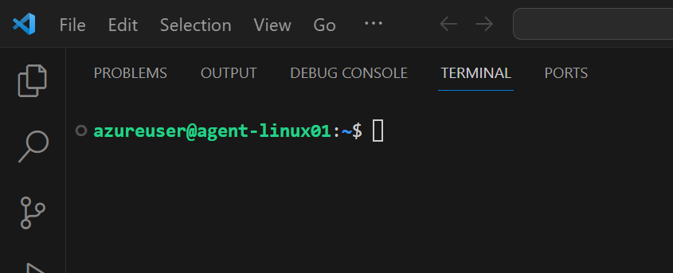

    2. Add the Agent pool for the project on the Azure Devops.
    Click on the Agent pool in the project settings.
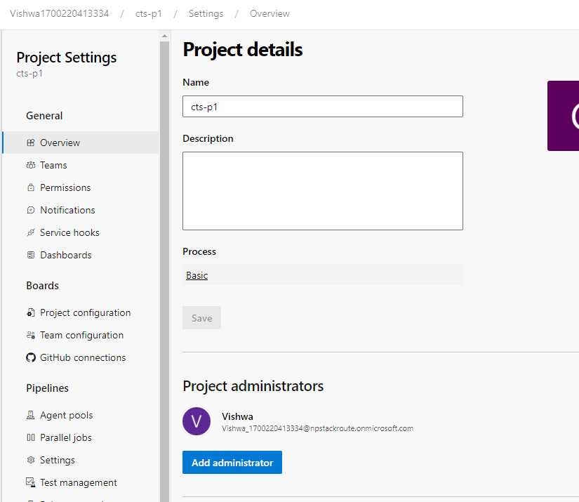

    Click on Add pool as shown
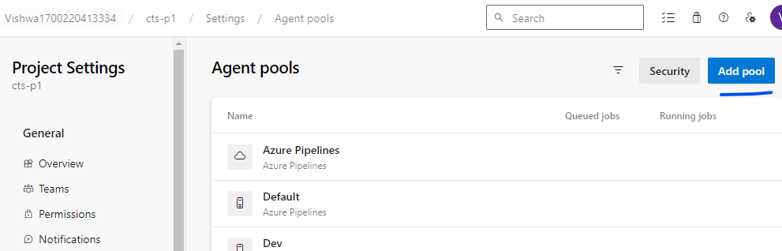

    Provide all the details, Under the pool type --> "self Hosted"
    Also, put an Tick on the "Grant Access permission to all pipelines".
    And Then click on "Create".
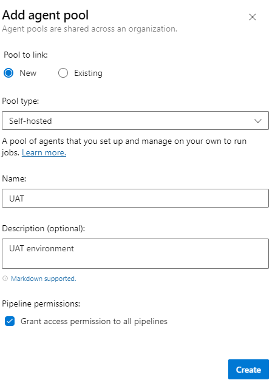
     
    Next we need to add the agent to this pool
    Click on "Agent" on the below screen. (We need to click on UAT to get this screen)
    And then click on "new agent"
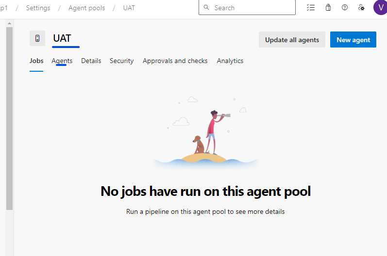

    There would be an popup, to donwload the software on the Linux machine, with further instructions to run to files.
    config.sh & 
    run.sh
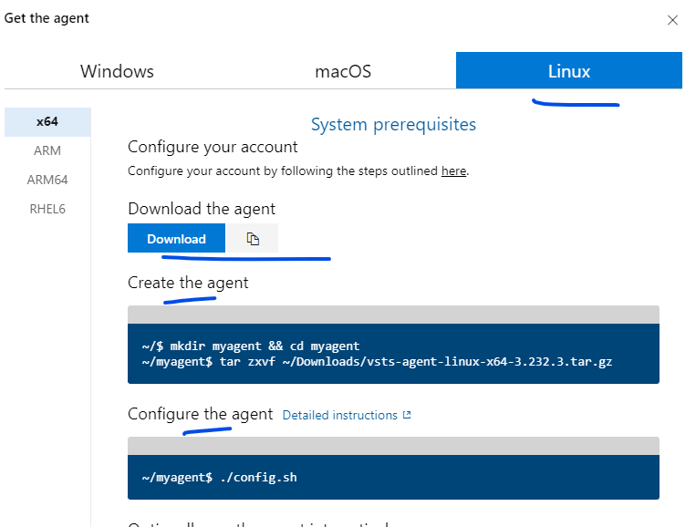

    3. Install the agent on the Linux machine.
       ```
       $ mkdir myagent
       $ wget -P myagent https://vstsagentpackage.azureedge.net/agent/3.232.3/vsts-agent-linux-x64-3.232.3.tar.gz
       $ tar zxvf myagent/vsts*.tar.gz"
       ```
       The above would extract in the home directory 
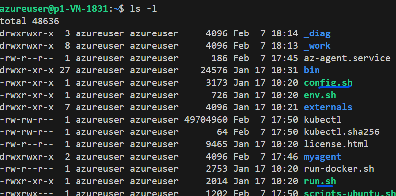

     4. Configure the agent and start the agent
       ```
       $ ./config.sh --unattended --url "https://dev.azure.com/Vishwa1700220413334" --token "4ioen44sdsggxdac75sf6dc4swpyzdjtyuhz35kbys6np2n" --agent "Agent-3" --pool "UAT"
       ./run.sh &
       ```
       The run command will run in the background.
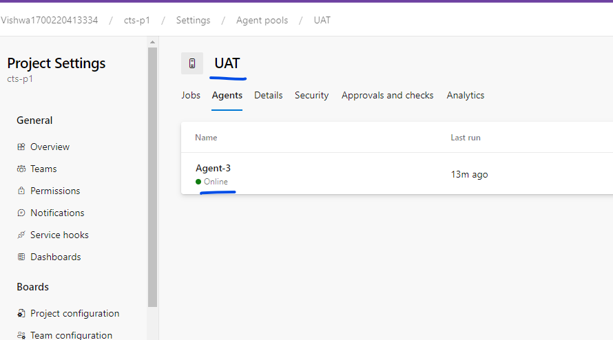

### Step2: Check the ACR for the image.
    Create an ACR repo (it needs to be unique)
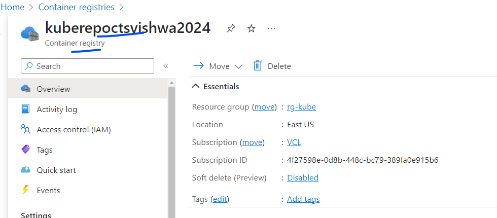


### Step3: Create Service connection on azure devops -- Option1
    In this step we will create an service connection that would be used in the azure pipeline to connect to the azure container registry
    1. Create service principle with key.
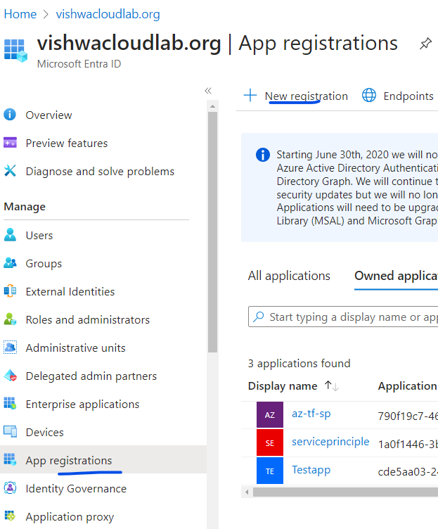
    Click on the "New Registration" and then give a name and click "Register.

    2. Once create it would look as below. Now lets create an secret and for that click on "Certifcates & Secrets"
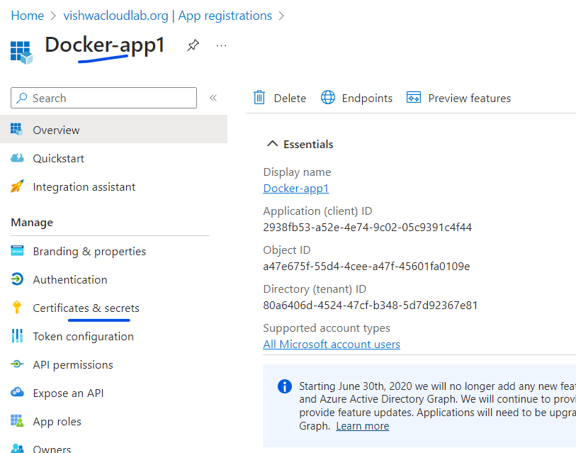

    3. Once you create the secrets, make an note of the value, as it would not be shown again.
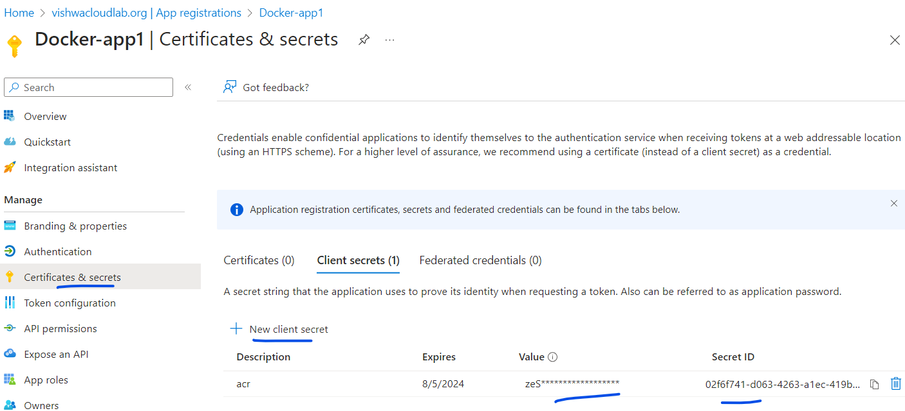

    4. Assign this service principle to the ACR that was create in the step2, using the "acecss Control".
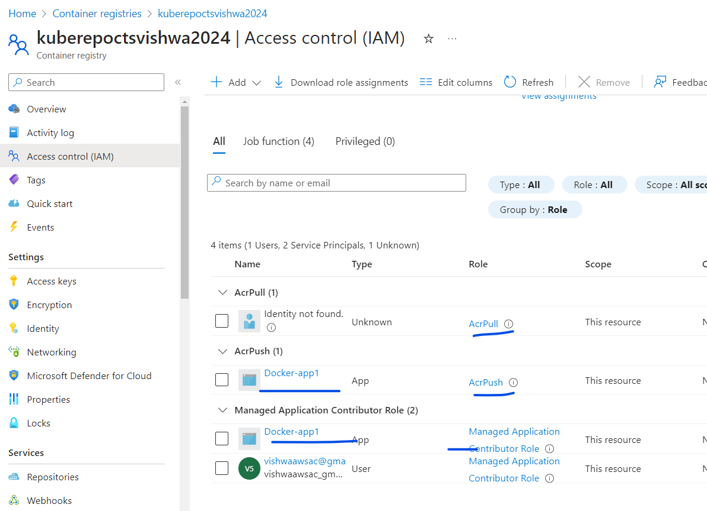

    5. on the azure devops click on the "Service COnnections" 
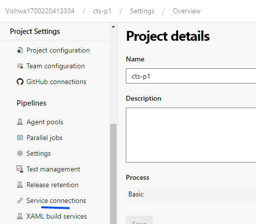
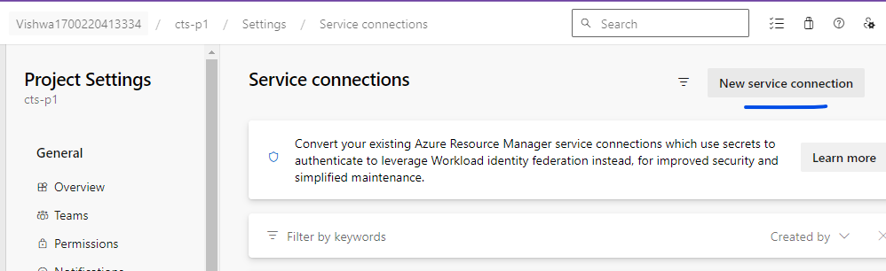
      Select "Azure Resource Manager" and click "Next"
      Select "Service principle (manual)
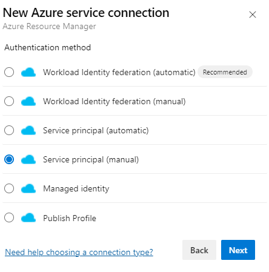    
      
      Provide the details.
      Subscription Id -->
      Service Principal Id --> This is Application (client) ID on the service princple.
      Service principal key --> the secret value that was created.
      Tenant ID --> Directory (tenant) ID on the service princple page.
      
      Click on "Verify"
      
      Note: -- To Tick for "Grant access permission to all pipelines"

### Step3: Create ACR Login -- Option2
     1. Select "Docker Registry" and Click "Next".
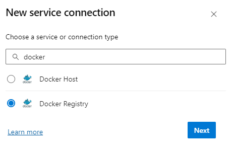

     2. INput the details for the login.
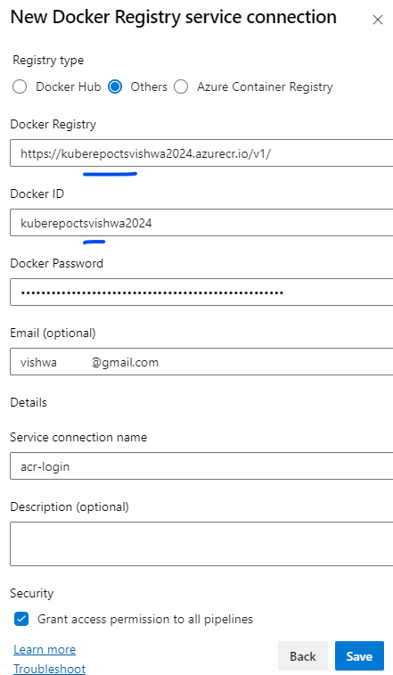
        Docker Registry --> https://kuberepoctsvishwa2024.azurecr.io/v1/
        Docker ID -->  kuberepoctsvishwa2024
        Docker Password --> 
        Email (optional)
        Service connection name --> "acr-login"

     3. The service connection finally looks like as belo
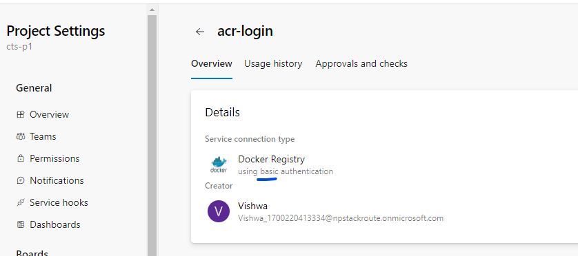